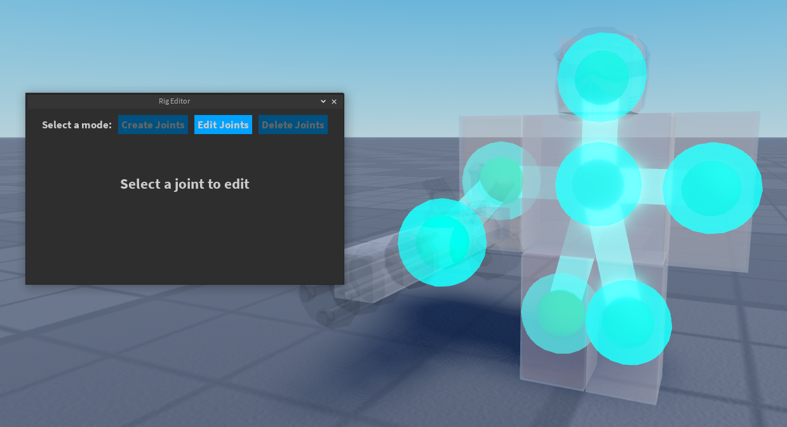

# New Tower Set
This guide contains instructions on how to set up models. For most cases, this will allow all models in a tower set to use the same rig, meaning they can share the same animations as well.

# Prerequisites
Moon Animator is used for welding. There may be alternatives you can use for creating `Motor6D`s and `Weld`s.

Editing the rig will require the following plugin: https://create.roblox.com/marketplace/asset/2908380847/Rig-Editor%3Fkeyword=&pageNumber=&pagePosition=.

Setting up the models will require the use of the Command Bar in Studio. This reduces the amount of manual labor needed. To open the Command Bar, click on the `View` tab, then click on `Command Bar`. You should see a text box that says "Run a command" at the bottom of Studio.


# Getting Started
As an example, I'll be setting up this Tower Battles tower. The models above are freshly imported (they're just `MeshPart`s, no rigs or welds yet):


## Creating our root part
First, let's add a `Part` that will act as our rig's root. Copy-and-paste the following code and run it on the Command Bar:
```lua
local RootPart = Instance.new("Part")
RootPart.CanCollide = false
RootPart.CanTouch = false
RootPart.Anchored = true
RootPart.Size = Vector3.new(0.8, 0.8, 0.4)
RootPart.TopSurface = Enum.SurfaceType.Smooth
RootPart.BottomSurface = Enum.SurfaceType.Smooth
RootPart.Parent = workspace
game:GetService("Selection"):Set({RootPart})
```
This should create and select a simple part that we will use:


## Adding the root part to all the characters
Now we can add the root to all the character models.
1. Make sure to have nothing selected initially.
2. Select the root part we created in the previous section.
3. Sequentially select the torsos of all the character models.

Your selections should look something like this:


Now, run the following code snippet with everything still selected. After running the code, **DO NOT DESELECT ANYTHING YET**:
```lua
local Selection = game:GetService("Selection")
local Selections = Selection:Get()
local TorsoTemplate = Selections[1] :: BasePart

for i = 2, #Selections do
	local Torso = Selections[i] :: BasePart
	local Character = Torso.Parent
	local RootPart: BasePart = TorsoTemplate:Clone()
	RootPart.CFrame = Torso.CFrame
	RootPart.Size = Torso.Size
	RootPart.Parent = Character
	RootPart.Name = "Root"
	Character.PrimaryPart = RootPart
end
```

You should now see that the root part we created earlier has been added to all the characters!


After verifying the root parts are positioned correctly, we need to make the root parts transparent. If everything looks good, run the following snippet:
```lua
local Selection = game:GetService("Selection")
local Selections = Selection:Get()

for i = 2, #Selections do
	local Torso = Selections[i] :: BasePart
	local Character = Torso.Parent
	Character.PrimaryPart.Transparency = 1
end
```
Now all the root parts should be invisible. You can deselect your current selection now:


You can also get rid of the template root part if you want.

## Creating base rigs
You should now differentiate towers that will have different rigs. In our example, they can all share the same rig. In some cases, some upgrades will need a different rig.

Let's set up the base rig for our example tower. Select the lowest level tower (it should look something like this):


Create a duplicate of the base level tower and move it off to the side:


Make everything except the root translucent, and make the root opaque:


Now create the torso/arms/legs/head of the rig. To do this easily, set the increment of whatever tool you use for building to be the smallest number in the root's size. **Make sure to name each part accordingly** for example "Left Leg" or "Right Arm":


After making the torso/arms/legs/head, you should have something like this. **Make sure you have created a Torso part. Typically this will be exactly the same as the root**:


If the character holds a weapon, create an additional rig part for the weapon. This should look something like this:


Now use Moon Animator's "Easy Weld" to weld the rig. Use the "Animatable" option and select "Join in Place". Ensure you select parts in the correct order. Below is an example list of weld operations you need to do:
- Root -> Torso
- Torso -> Head
- Torso -> Right Arm
- Torso -> Left Arm
- Torso -> Right Leg
- Torso -> Left Leg
- Right Arm -> Weapon

Here's an example of what the welds should look like:


We're almost done setting up the rig! The final step is to edit the rig so that the animator can use it. Temporarily add an `AnimationController` to the rig's model so we can edit the rig:


Then, open up the Rig Editor plugin (mentioned in the Prerequisites section) and select the model:


After hitting "Continue", hit the "Edit Joints" button:



Now move the joints to the position you'd expect them to be in. For example:


Hit "Commit Changes" to finalize the changes. Now the rig is set up!


If you have an animation plugin, you'll see that you can now manipulate the base rig. The mesh parts from your model will not move yet, as they are not connected to the base rig yet.


## Preparing model for animator
We just need to attach the model's meshes to the base rig. First, group anything appearance-related into a group called `Appearance`:


Now, use Moon Animator's "Easy Weld" to weld an appearance-related item to its respective rig part. For example, the mask and head meshes should be welded to the "Head" rig part. Make sure "Animatable" is unchecked. Also make sure the "Base Part" is the rig part! Then select "Join in Place":


After welding, it should look something like this:


Now, we can make the mesh parts opaque again, and make the rig parts invisible:


The tower is now ready for animation! This rig can be shared for the other models. Send this model to the animator and they will be able to work with it.

## Setting up character models
We have now created the base rig. The remaining character models for upgrades need to be formatted so that they can be applied to the base rig correctly. Recall that our base rig contains the following rig parts:


TDX's system will weld appearance-related parts to the relevant rig part in the base rig.

Let's return to our unrigged tower models and set up the base level tower:


We need to name the appearance part the name of the rig part it will be welded to. For example, in the base level tower, we have the following:


We want the left arm mesh to be attached to the left arm of the rig. So, we need to name it "Left Arm", matching with the base rig:


In cases where there are several things attached to the same rig part, the additional items can be parented under the part. For example, the character model has a head and mask which should both be attached to the rig's head. In this case, name the head "Head" and parent the mask mesh under it:


After naming everything, our base level tower looks like this:


We're almost done with this particular model. We now just need to define points of interest such as where bullet VFX will appear. In our example's case, we want to define where the barrel is. To do this, use an invisible part to define where the barrel is. Since we want this to move with the weapon, parent it under the "Weapon" (in this case the minigun). Name it `Attachment__` followed by the name of the point of interest. In this case, I have named it `Attachment__Barrel`.


We're now done setting this model up. Repeat the steps in [Setting up character models](#setting-up-character-models) for each model in the tower set:


# Conclusion
Please let me (Atrazine) know if you have any questions, or if you spot an issues with the guide.
